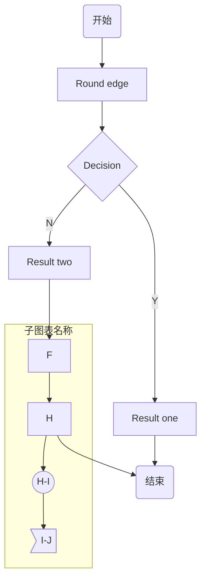
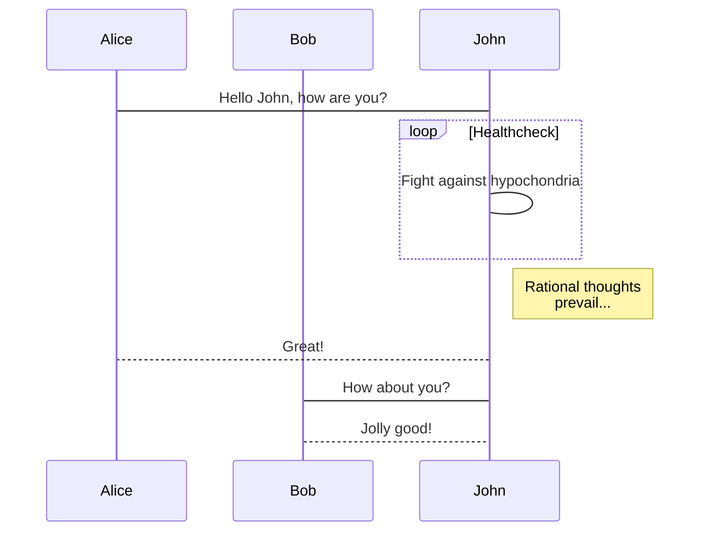
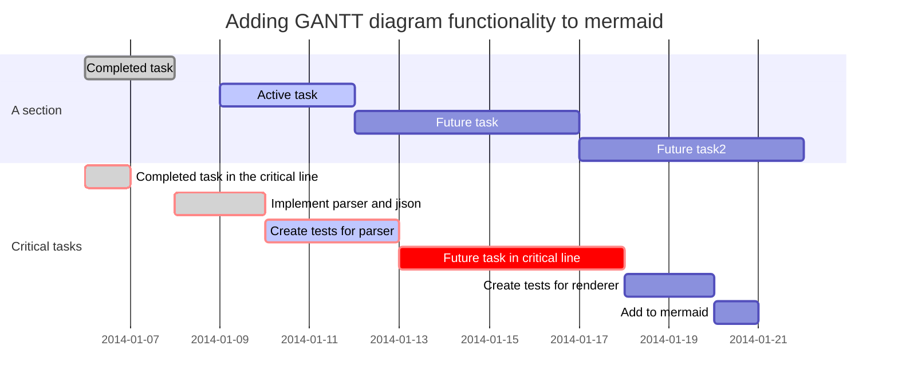

## 标题
~~~
#,一级标题 
##,二级标题
###,三级标题 
~~~
## 列表
~~~
1. 有序列表 
2. 有序列表 
3. 无序列表
~~~

## 引用
~~~
> 有的人活着，他已经死了；有的人死了，他还活着
~~~
> 有的人活着，他已经死了；有的人死了，他还活着

## 图片
~~~

~~~


## 链接
~~~
[Google](https://www.google.com/)
~~~
[Google](https://www.google.com/)

## 分割线
~~~
***
~~~
***

## 粗体/斜体
~~~
**作者**
*张三*
~~~
**作者**
*张三*

## 代码
~~~
```sh
#/bin/sh
echo "hello world"
```
~~~
```sh
#/bin/sh
echo "hello world"
```

## 区块标识
~~~
这是一个区块
~~~

## 数学公式
### 上标、下标与组合
+ 上标符号，符号：^
+ 下标符号，符号：_
+ 组合符号，符号：{}
$$
x^4
$$

$$
x_1
$$

$$
{16}_{8}O{2+}_{2}
$$

### 汉字、字体与格式
+ 汉字形式，符号：\mbox{}
+ 字体控制，符号：\displaystyle
+ 下划线符号，符号：\underline
+ 标签，符号\tag{数字}
+ 上大括号，符号：\overbrace{算式}
+ 下大括号，符号：\underbrace{算式}
+ 上位符号，符号：\stacrel{上位符号}{基位符号}
$$
V_{\mbox{初始}}
$$

$$
\displaystyle \frac{x+y}{y+z}
$$

$$
\underline{x+y}
$$

$$
\tag{11}
$$

$$
\overbrace{a+b+c+d}^{2.0}
$$

$$
a+\underbrace{b+c}_{1.0}+d
$$

$$
\vec{x}\stackrel{\mathrm{def}}{=}{x_1,\dots,x_n}
$$

### 占位符
+ 两个quad空格，符号：\qquad
+ quad空格，符号：\quad
+ 大空格，符号\
+ 中空格，符号\:
+ 小空格，符号\,
+ 没有空格，符号``
+ 紧贴，符号\!
$$
x \qquad y
$$

$$
x \quad y
$$

$$
x \ y
$$

$$
x : y
$$

$$
x , y
$$

$$
xy
$$

$$
x ! y
$$

### 定界符与组合
+ 括号，符号：（）\big(\big) \Big(\Big) \bigg(\bigg) \Bigg(\Bigg)
+ 中括号，符号：[]
+ 大括号，符号：\{ \}
+ 自适应括号，符号：\left \right
+ 组合公式，符号：{上位公式 \choose 下位公式}
+ 组合公式，符号：{上位公式 \atop 下位公式}
$$
（）\big(\big) \Big(\Big) \bigg(\bigg) \Bigg(\Bigg)
$$

$$
[x+y]
$$

$$
{x+y}
$$

$$
\left(x\right)$，$\left(x{yz}\right)
$$

$$
{n+1 \choose k}={n \choose k}+{n \choose k-1}
$$

$$
\sum_{k_0,k_1,\ldots>0 \atop k_0+k_1+\cdots=n}A_{k_0}A_{k_1}\cdots
$$

### 四则运算
+ 加法运算，符号：+
+ 减法运算，符号：-
+ 加减运算，符号：\pm
+ 减甲运算，符号：\mp
+ 乘法运算，符号：\times
+ 点乘运算，符号：\cdot
+ 星乘运算，符号：\ast
+ 除法运算，符号：\div
+ 斜法运算，符号：/
+ 分式表示，符号：\frac{分子}{分母}
+ 分式表示，符号：{分子} \voer {分母}
+ 绝对值表示，符号：||

$$
x+y=z
$$

$$
x-y=z
$$

$$
x \pm y=z
$$

$$
x \mp y=z
$$

$$
x \times y=z
$$

$$
x \cdot y=z
$$

$$
x \ast y=z
$$

$$
x \div y=z
$$

$$
x/y=z
$$

$$
\frac{x+y}{y+z}
$$

$$
{x+y} \over {y+z}
$$

$$
|x+y|
$$

$$
\overline{xyz}
$$

### 高级运算
+ 平均数运算，符号：\overline{算式}
+ 开二次方运算，符号：\sqrt
+ 开方运算，符号：\sqrt[开方数]{被开方数}
+ 对数运算，符号：\log
+ 极限运算，符号：\lim
+ 极限运算，符号：\displaystyle \lim
+ 求和运算，符号：\sum
+ 求和运算，符号：\displaystyle \sum
+ 积分运算，符号：\int
+ 积分运算，符号：\displaystyle \int
+ 微分运算，符号：\partial
+ 矩阵表示，符号：\begin{matrix} \end{matrix}
$$
\overline{xyz}
$$

$$
\sqrt x
$$

$$
\sqrt[3]{x+y}
$$

$$
\log(x)
$$

$$
\lim^{x \to \infty}_{y \to 0}{\frac{x}{y}}
$$

$$
\displaystyle \lim^{x \to \infty}_{y \to 0}{\frac{x}{y}}
$$

$$
\sum^{x \to \infty}_{y \to 0}{\frac{x}{y}}
$$

$$
\displaystyle \sum^{x \to \infty}_{y \to 0}{\frac{x}{y}}
$$

$$
\int^{\infty}_{0}{xdx}
$$

$$
\displaystyle \int^{\infty}_{0}{xdx}
$$

$$
\frac{\partial x}{\partial y}
$$

$$
\left[ \begin{matrix} 1 &2 &\cdots &4\5 &6 &\cdots &8\\vdots &\vdots &\ddots &\vdots\13 &14 &\cdots &16\end{matrix} \right]
$$

### 逻辑运算
+ 等于运算，符号：=
+ 大于运算，符号：>
+ 小于运算，符号：<
+ 大于等于运算，符号：\geq
+ 小于等于运算，符号：\leq
+ 不等于运算，符号：\neq
+ 不大于等于运算，符号：\ngeq
+ 不大于等于运算，符号：\not\geq
+ 不小于等于运算，符号：\nleq
+ 不小于等于运算，符号：\not\leq
+ 约等于运算，符号：\approx
+ 恒定等于运算，符号：\equiv

$$
x+y=z
$$

$$
x+y>z
$$

$$
x+y<z
$$

$$
x+y \geq z
$$

$$
x+y \leq z
$$

$$
x+y \neq z
$$

$$
x+y \ngeq z
$$

$$
x+y \not\geq z
$$

$$
x+y \nleq z
$$

$$
x+y \not\leq z
$$

$$
x+y \approx z
$$

$$
x+y \equiv z
$$

### 集合运算
+ 属于运算，符号：\in
+ 不属于运算，符号：\notin
+ 不属于运算，符号：\not\in
+ 子集运算，符号：\subset
+ 子集运算，符号：\supset
+ 真子集运算，符号：\subseteq
+ 非真子集运算，符号：\subsetneq
+ 真子集运算，符号：\supseteq
+ 非真子集运算，符号：\supsetneq
+ 非子集运算，符号：\not\subset
+ 非子集运算，符号：\not\supset
+ 并集运算，符号：\cup
+ 交集运算，符号：\cap
+ 差集运算，符号：\setminus
+ 同或运算，符号：\bigodot
+ 同与运算，符号：\bigotimes
+ 实数集合，符号：\mathbb{R}
+ 自然数集合，符号：\mathbb{Z}
+ 空集，符号：\emptyset
$$
x \in y
$$

$$
x \notin y
$$

$$
x \not\in y
$$

$$
x \subset y
$$

$$
x \supset y
$$

$$
x \subseteq y
$$

$$
x \subsetneq y
$$

$$
x \supseteq y
$$

$$
x \supsetneq y
$$

$$
x \not\subset y
$$

$$
x \not\supset y
$$

$$
x \cup y
$$

$$
x \cap y
$$

$$
x \setminus y
$$

$$
x \bigodot y
$$

$$
x \bigotimes y
$$

$$
\mathbb{R}
$$

$$
\mathbb{Z}
$$

$$
\emptyset
$$

### 数学符号
+ 无穷，符号：\infty
+ 虚数，符号：\imath
+ 虚数，符号：\jmath
+ 数学符号，符号\hat{a}
+ 数学符号，符号\check{a}
+ 数学符号，符号\breve{a}
+ 数学符号，符号\tilde{a}
+ 数学符号，符号\bar{a}
+ 矢量符号，符号\vec{a}
+ 数学符号，符号\acute{a}
+ 数学符号，符号\grave{a}
+ 数学符号，符号\mathring{a}
+ 一阶导数符号，符号\dot{a}
+ 二阶导数符号，符号\ddot{a}
+ 上箭头，符号：\uparrow
+ 上箭头，符号：\Uparrow
+ 下箭头，符号：\downarrow
+ 下箭头，符号：\Downarrow
+ 左箭头，符号：\leftarrow
+ 左箭头，符号：\Leftarrow
+ 右箭头，符号：\rightarrow
+ 右箭头，符号：\Rightarrow
+ 底端对齐的省略号，符号：\ldots
+ 中线对齐的省略号，符号：\cdots
+ 竖直对齐的省略号，符号：\vdots
+ 斜对齐的省略号，符号：\ddots
$$
\infty
$$

$$
\imath
$$

$$
\jmath
$$

$$
\hat{a}
$$

$$
\check{a}
$$

$$
\breve{a}
$$

$$
\tilde{a}
$$

$$
\bar{a}
$$

$$
\vec{a}
$$

$$
\acute{a}
$$

$$
\grave{a}
$$

$$
\mathring{a}
$$

$$
\dot{a}
$$

$$
\ddot{a}
$$

$$
\uparrow
$$

$$
\Uparrow
$$

$$
\downarrow
$$

$$
\Downarrow
$$

$$
\leftarrow
$$

$$
\Leftarrow
$$

$$
\rightarrow
$$

$$
\Rightarrow
$$

$$
1,2,\ldots,n
$$

$$
x_1^2 + x_2^2 + \cdots + x_n^2
$$

$$
\vdots
$$

$$
\ddots
$$

### 希腊字母

|字母	|实现	|字母|	实现|
| ------ | ------ | -------------- | ------ |
| A |	A	| α	| \alhpa |
| B |	B	| β	| \beta |
| Γ |	\Gamma	| γ |	\gamma |
| Δ |	\Delta	| δ |	\delta |
| E |	E	| ϵ |	\epsilon |
| Z |	Z	| ζ |	\zeta |
| H |	H	| η |	\eta |
| Θ |	\Theta	|θ|	\theta |
| I |	I	|ι|	\iota |
| K |	K	|κ|	\kappa |
| Λ |	\Lambda	|λ|	\lambda |
| M |	M	| μ | \mu |
| N |	N	| ν | \nu |
| Ξ |	\Xi	| ξ | \xi |
| O |	O	| ο | \omicron |
| Π |	\Pi	| π | \pi |
| P |	P	| ρ | \rho |
| Σ |	\Sigma |	σ	| \sigma |
| T |	T|	τ	| \tau |
| Υ |	\Upsilon |	υ|	\upsilon |
| Φ |	\Phi	|ϕ|	\phi |
| X |	X	|χ|	\chi |
| Ψ |	\Psi|	ψ|	\psi |
| Ω |	\v|	ω	|\omega |

## 表格

| 姓名   | 性别   | 毕业学校       | 工资   |
| ------ | ------ | -------------- | ------ |
| 张三   | 男     | 重庆交通大学   | 3200   |
| 李四   | 男     | 贵州大学       | 5000   |
| 王五   | 女     | 北京大学       | 2000   |

| name    | description |
|---------|-------------|
| :\-\-\- | 左对齐      |
| \-\-\-: | 右对齐      |
| \-\-\-  | 居中        |

## 使用 sequence 画时序图
注意: GitHub 暂不支持，或者说作者没有找到可用的第三方组件提供支持，所以在这你是看不到效果啦！
```sequence
title: 时序图例子
A->B: 实线实箭头 
B-->C: 虚线实箭头 
C->>C: 实线虚箭头 
note right of C: 自通知 
note over B,C:横跨通知 
C->A:长通知 
note left of A:左通知
```
## 使用 flow 画流程图
注意: GitHub 暂不支持，或者说作者没有找到可用的第三方组件提供支持，所以在这你是看不到效果啦！
```flow
start=>start: 开始
isLogin=>condition: 是否登录
login=>operation: 登录
check=>subroutine: 校验用户信息
view=>operation: 浏览
end=>end: 结束
start->isLogin
isLogin(no)->login(right)->check->view
isLogin(yes)->view
view->end
```

## 使用 mermaid 画图
### 简介
Mermaid 是一个用于画流程图、状态图、时序图、甘特图的库，使用 JS 进行本地渲染，广泛集成于许多 Markdown 编辑器中。
Mermaid 作为一个使用 JS 渲染的库，生成的不是一个“图片”，而是一段 HTML 代码
详细参考：https://mermaid-js.github.io/mermaid/
### 图表方向

| name | description |
|------|-------------|
| TB   | 从上到下    |
| BT   | 从下到上    |
| RL   | 从右到左    |
| LR   | 从左到右    |
### 节点定义

| name       | description    |
|------------|----------------|
| id[文字]   | 矩形节点       |
| id(文字)   | 圆角矩形节点   |
| id((文字)) | 圆形节点       |
| id\>文字]  | 右向旗帜状节点 |
| id{文字}   | 菱形节点       |

### 节点之间的连接线

| name     | description                |
|----------|----------------------------|
| \>       | 添加尾部箭头               |
| \-       | 不添加尾部箭头             |
| –        | 单线                       |
| –text–   | 单线上加文字               |
| ==       | 粗线                       |
| ==text== | 粗线加文字                 |
| -.-      | 虚线                       |
| -.text.- | 虚线加文字                 |
| ->       | 无箭头的实线               |
| –>       | 无箭头的虚线               |
| -\>\>    | 有箭头的实线               |
| –\>\>    | 有箭头的虚线               |
| -x       | 末端为叉的实线（表示异步） |
| –x       | 末端为叉的虚线（表示异步） |

### mermaid: 流程图
~~~shell
graph TB
A(开始) --> B[Round edge]
B --> C{Decision}
C -->|Y| D[Result one]
C -->|N| E[Result two]
E -->F
subgraph 子图表名称
F -- This is the text ---> H
H --> I((H-I))
I --> J>I-J]
end
H --> Z(结束)
D --> Z
~~~

### mermaid: 序列图
~~~
sequenceDiagram
    participant Alice
    participant Bob
    Alice->John: Hello John, how are you?
    loop Healthcheck
        John->John: Fight against hypochondria
    end
    Note right of John: Rational thoughts <br/>prevail...
    John-->Alice: Great!
    John->Bob: How about you?
    Bob-->John: Jolly good!
~~~


### mermaid: 甘特图
~~~
gantt
        dateFormat  YYYY-MM-DD
        title Adding GANTT diagram functionality to mermaid
        section A section
        Completed task            :done,    des1, 2014-01-06,2014-01-08
        Active task               :active,  des2, 2014-01-09, 3d
        Future task               :         des3, after des2, 5d
        Future task2               :         des4, after des3, 5d
        section Critical tasks
        Completed task in the critical line :crit, done, 2014-01-06,24h
        Implement parser and jison          :crit, done, after des1, 2d
        Create tests for parser             :crit, active, 3d
        Future task in critical line        :crit, 5d
        Create tests for renderer           :2d
        Add to mermaid                      :1d
~~~

