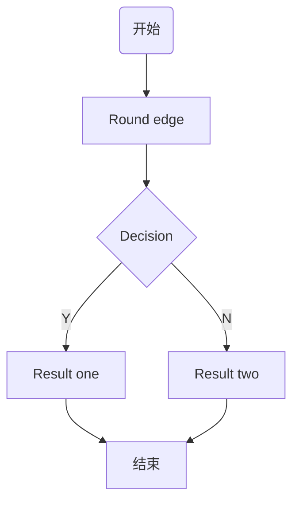

1. 标题
# 一级标题 
## 二级标题
### 三级标题 
2. 列表
   1. 有序列表 
   2. 有序列表 
   + 无序列表
3. 引用
> 有的人活着，他已经死了；有的人死了，他还活着
4. 图片

5. 链接
[Google](https://www.google.com/)
6. 分割线
***
7. 粗体/斜体
**作者**
*张三*
8. 代码
```sh
#/bin/sh
echo "hello world"
```
9. 区块标识
~~~
这是一个区块
……
~~~
10. 表格
|姓名|性别|毕业学校|工资|
|:---|:---:|:---:|---:|
|张三|男|重庆交通大学|3200|
|李四|男|贵州大学|5000|
|王五|女|北京大学|2000|
> :--- 左对齐
> ---: 右对齐
> --- 居中
11. 时序图
```sequence
title: 时序图例子
A->B: 实线实箭头 
B-->C: 虚线实箭头 
C->>C: 实线虚箭头 
note right of C: 自通知 
note over B,C:横跨通知 
C->A:长通知 
note left of A:左通知
```
12. 流程图
```flow
start=>start: 开始
isLogin=>condition: 是否登录
login=>operation: 登录
view=>operation: 浏览
end=>end: 结束
start->isLogin
isLogin(no)->login->view
isLogin(yes)->view
view->end
```
