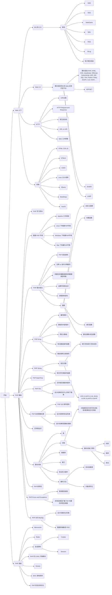

## PHP Programmer 升级之路

```mermaid
graph LR
start[开始] --> web_start(Web 入门)
    web_start --> bs_cs(B/S 和 C/S)
        bs_cs--> bs_example(举例)
            bs_example-->SMS
            bs_example-->SNS
            bs_example-->WebGame
            bs_example-->Wiki
            bs_example-->RSS
            bs_example-->BLog
            bs_example-->ec(电子商务系统)
   web_start-->web_2.0(Web 2.0)
       web_2.0-->main_platform(脚本语言和主流 Web 应用开发平台)
           main_platform-->script_language(脚本语言:PHP, HTML, CSS, JavaScript, VBScript, ActionScript, ASP, JSP, SQL, Perl, Python, Ruby, JavaFx, Lua, AutoIt, ...)
           main_platform-->asp.net(ASP.NET)
           main_platform-->javaee(JavaEE)
           main_platform-->lamp(LAMP)
    web_start-->http(HTTP)
        http-->work_process(工作过程)
        http-->http_request_response(HTTP Request and Response)
        http-->status_code(常见状态码)
        http-->url_uri(URL vs URI)
        http-->web_work_principle(Web 工作原理)
    web_start-->frontend(前端)
    	frontend-->html_css_js(HTML-CSS-JS)
    	frontend-->html5(HTML5)
    	frontend-->css3(CSS3)
    	frontend-->less(Less CSS 框架)
    	frontend-->jquery(JQuery)
    	frontend-->bootstrap(BootStrap)
    	frontend-->vuejs(VueJS)

start --> php_foundation(PHP 基础)
    php_foundation-->php_learning_road(PHP 学习导向)
	php_foundation-->build_php_environment(搭建 PHP 环境)
        build_php_environment-->apache_principle(Apache 工作机制)
		build_php_environment-->php_linux(Linux 下构建PHP环境)
		build_php_environment-->php_windows(Windows 下构建PHP环境)
		build_php_environment-->php_Mac(Mac 下构建PHP环境)
	php_foundation-->php_basis(PHP 基本语法)
		php_basis-->php_syntactic(PHP 语法结构)
		php_basis-->comment(注释 vs 指令分隔副符)
		php_basis-->variable(变量及变量数据类型和数据类型转换)
		php_basis-->expression(运算符和表达式)
		php_basis-->flow_control(流程控制语句)
		php_basis-->functions(函数)
			functions-->custom_function(自定义函数)
			functions-->built_in_function(内置函数)
			functions-->recursive_function(递归函数)
			functions-->anonymous_function(匿名函数/闭包函数)
	php_foundation-->php_array(PHP Array)
		php_array-->traversal_array(遍历数组)
		php_array-->array_pointer(数组的内部指针)
		php_array-->predefined_array(预定义数组)
		php_array-->array_operator(常见数组操作函数)
		php_array-->array_notice_thing(数组使用注意事项)
	php_foundation-->php_string(PHP String)
		php_string-->common_question(常见问题)
			common_question-->single_double_quotes(单引号和双引号的区别)
			common_question-->output_function(echo vs print vs var_dump vs die vs printf vs sprintf)
		php_string-->string_operator(常见字符串操作函数)
	php_foundation-->php_datetime(PHP Date/Time)
	php_foundation-->php_file(PHP File)
		php_file-->file_operator(文件或目录基本操作)
		php_file-->file_upload_download(设计经典的文件上传和下载类)
	php_foundation-->php_images(PHP 动态图像处理)
		php_images-->php_gd(PHP GD 库的使用)
		php_images-->php_verify_code(设计经典的验证码类)
		php_images-->php_img_clas(设计经典的图像处理类)
	php_foundation-->regular_expression(正则表达式)
	php_foundation-->object_oriented(面向对象)
		object_oriented-->class_obj(类)
		object_oriented-->object(对象)
			object-->object_memory(对象类型在内存中的分配-栈/堆/静态区/代码段)
			object-->three_attribute(面向对象三特性)
				three_attribute-->object_package(封装)
				three_attribute-->object_inherit(继承)
				three_attribute-->object_olymorphism(多态)
		object_oriented-->abstract(抽象类)
		object_oriented-->interfaces(接口)
		object_oriented-->common_keyword(常见的关键字)
		object_oriented-->magic_method(魔术方法)
			magic_method-->auto_load(自动加载类)
			magic_method-->object_serialization(对象序列化)
	php_foundation-->php_new_attributes(PHP 新特性)
	php_foundation-->php_error_exception(PHP Errors and Exceptions)
		php_error_exception-->php_error_level(错误报告级别)
		php_error_exception-->php_error_handle(异常处理及扩展 PHP 内置的异常处理类)
	php_foundation-->php_mysql(PHP 访问 MySQL)
		php_mysql-->php_page(设计完美的分页类)
		php_mysql-->db_pdo(数据库抽象层 PDO)
start --> php_advanced(PHP 高级)
	php_advanced --> memcache(Memcache)
	php_advanced --> redis(Redis) 
	php_advanced --> session_control(会话控制)
        session_control --> Cookie
        session_control--> Session
	php_advanced --> php_curl(PHP 的 CURL 扩展模块)
	php_advanced --> php_smarty(Smarty)
	php_advanced --> php_mvc(MVC 架构思想)
	php_advanced --> php_security(PHP 的安全和优化)
```
