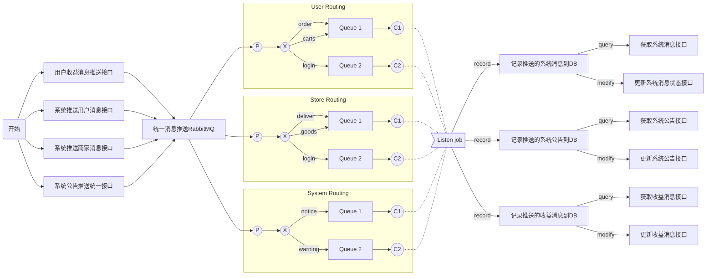

```mermaid
graph LR
A(开始) -->A1-1[用户收益消息推送接口]
A(开始) -->A1-2[系统推送用户消息接口]
A(开始) -->A2-1[系统推送商家消息接口]
A(开始) -->A3-1[系统公告推送统一接口]

A1-1 --> B[统一消息推送RabbitMQ]
A1-2 --> B[统一消息推送RabbitMQ]
A2-1 --> B[统一消息推送RabbitMQ]
A3-1 --> B[统一消息推送RabbitMQ]

B --> C1((P))
B --> C2((P))
B --> C3((P))

subgraph User Routing
C1 --> D1((X))
D1 --> |order| E1-1[Queue 1]
D1 --> |carts| E1-1[Queue 1]
D1 --> |login| E1-2[Queue 2]
E1-1 --> F1-1((C1))
E1-2 --> F1-2((C2))
end

subgraph Store Routing
C2 --> D2((X))
D2 --> |deliver| E2-1[Queue 1]
D2 --> |goods| E2-1[Queue 1]
D2 --> |login| E2-2[Queue 2]
E2-1 --> F2-1((C1))
E2-2 --> F2-2((C2))
end

subgraph System Routing
C3 --> D3((X))
D3 --> |notice| E3-1[Queue 1]
D3 --> |warning| E3-2[Queue 2]
E3-1 --> F3-1((C1))
E3-2 --> F3-2((C2))
end

F1-1 .- H>Listen job]
F1-2 .- H>Listen job]
F2-1 .- H>Listen job]
F2-2 .- H>Listen job]
F3-1 .- H>Listen job]
F3-2 .- H>Listen job]

H --> |record| I1[记录推送的系统消息到DB]
H --> |record| I2[记录推送的系统公告到DB]
H --> |record| I3[记录推送的收益消息到DB]

I1 --> |query| J1[获取系统消息接口]
I1 --> |modify| K1[更新系统消息状态接口]
I2 --> |query| J2[获取系统公告接口]
I2 --> |modify| K2[更新系统公告接口]
I3 --> |query| J3[获取收益消息接口]
I3 --> |modify| K3[更新收益消息接口]
```