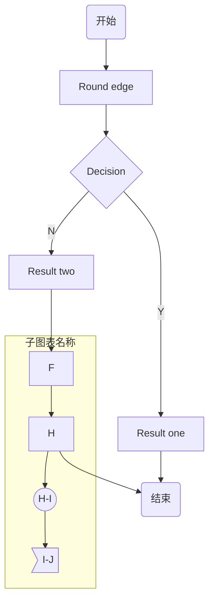
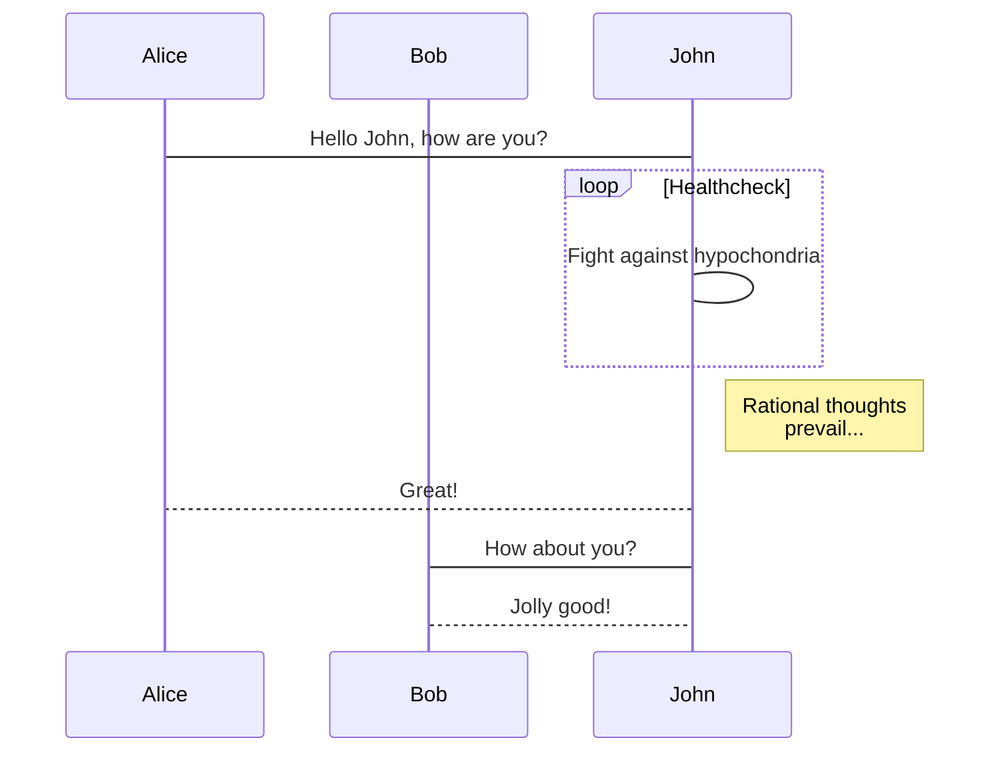
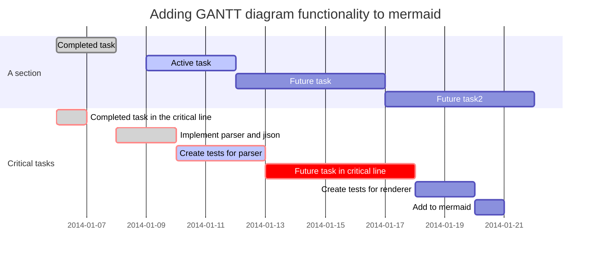

## 标题
~~~
#,一级标题 
##,二级标题
###,三级标题 
~~~
## 列表
~~~
1. 有序列表 
2. 有序列表 
3. 无序列表
~~~

## 引用
~~~
> 有的人活着，他已经死了；有的人死了，他还活着
~~~
> 有的人活着，他已经死了；有的人死了，他还活着

## 图片
~~~

~~~


## 链接
~~~
[Google](https://www.google.com/)
~~~
[Google](https://www.google.com/)

## 分割线
~~~
***
~~~
***

## 粗体/斜体
~~~
**作者**
*张三*
~~~
**作者**
*张三*

## 代码
~~~
```sh
#/bin/sh
echo "hello world"
```
~~~
```sh
#/bin/sh
echo "hello world"
```

## 区块标识
~~~
这是一个区块
~~~

## 表格

| 姓名   | 性别   | 毕业学校       | 工资   |
| ------ | ------ | -------------- | ------ |
| 张三   | 男     | 重庆交通大学   | 3200   |
| 李四   | 男     | 贵州大学       | 5000   |
| 王五   | 女     | 北京大学       | 2000   |

| name    | description |
|---------|-------------|
| :\-\-\- | 左对齐      |
| \-\-\-: | 右对齐      |
| \-\-\-  | 居中        |

## 使用 sequence 画时序图
注意: GitHub 暂不支持，或者说作者没有找到可用的第三方组件提供支持，所以在这你是看不到效果啦！
```sequence
title: 时序图例子
A->B: 实线实箭头 
B-->C: 虚线实箭头 
C->>C: 实线虚箭头 
note right of C: 自通知 
note over B,C:横跨通知 
C->A:长通知 
note left of A:左通知
```
## 使用 flow 画流程图
注意: GitHub 暂不支持，或者说作者没有找到可用的第三方组件提供支持，所以在这你是看不到效果啦！
```flow
start=>start: 开始
isLogin=>condition: 是否登录
login=>operation: 登录
check=>subroutine: 校验用户信息
view=>operation: 浏览
end=>end: 结束
start->isLogin
isLogin(no)->login(right)->check->view
isLogin(yes)->view
view->end
```

## mermaid
### 简介
Mermaid 是一个用于画流程图、状态图、时序图、甘特图的库，使用 JS 进行本地渲染，广泛集成于许多 Markdown 编辑器中。
Mermaid 作为一个使用 JS 渲染的库，生成的不是一个“图片”，而是一段 HTML 代码
### 图表方向

| name | description |
|------|-------------|
| TB   | 从上到下    |
| BT   | 从下到上    |
| RL   | 从右到左    |
| LR   | 从左到右    |
### 节点定义

| name       | description    |
|------------|----------------|
| id[文字]   | 矩形节点       |
| id(文字)   | 圆角矩形节点   |
| id((文字)) | 圆形节点       |
| id\>文字]  | 右向旗帜状节点 |
| id{文字}   | 菱形节点       |

### 节点之间的连接线

| name     | description                |
|----------|----------------------------|
| \>       | 添加尾部箭头               |
| \-       | 不添加尾部箭头             |
| –        | 单线                       |
| –text–   | 单线上加文字               |
| ==       | 粗线                       |
| ==text== | 粗线加文字                 |
| -.-      | 虚线                       |
| -.text.- | 虚线加文字                 |
| ->       | 无箭头的实线               |
| –>       | 无箭头的虚线               |
| -\>\>    | 有箭头的实线               |
| –\>\>    | 有箭头的虚线               |
| -x       | 末端为叉的实线（表示异步） |
| –x       | 末端为叉的虚线（表示异步） |

### mermaid: 流程图
~~~shell
graph TB
A(开始) --> B[Round edge]
B --> C{Decision}
C -->|Y| D[Result one]
C -->|N| E[Result two]
E -->F
subgraph 子图表名称
F -- This is the text ---> H
H --> I((H-I))
I --> J>I-J]
end
H --> Z(结束)
D --> Z
~~~

### mermaid: 序列图
~~~
sequenceDiagram
    participant Alice
    participant Bob
    Alice->John: Hello John, how are you?
    loop Healthcheck
        John->John: Fight against hypochondria
    end
    Note right of John: Rational thoughts <br/>prevail...
    John-->Alice: Great!
    John->Bob: How about you?
    Bob-->John: Jolly good!
~~~


### mermaid: 甘特图
~~~
gantt
        dateFormat  YYYY-MM-DD
        title Adding GANTT diagram functionality to mermaid
        section A section
        Completed task            :done,    des1, 2014-01-06,2014-01-08
        Active task               :active,  des2, 2014-01-09, 3d
        Future task               :         des3, after des2, 5d
        Future task2               :         des4, after des3, 5d
        section Critical tasks
        Completed task in the critical line :crit, done, 2014-01-06,24h
        Implement parser and jison          :crit, done, after des1, 2d
        Create tests for parser             :crit, active, 3d
        Future task in critical line        :crit, 5d
        Create tests for renderer           :2d
        Add to mermaid                      :1d
~~~

