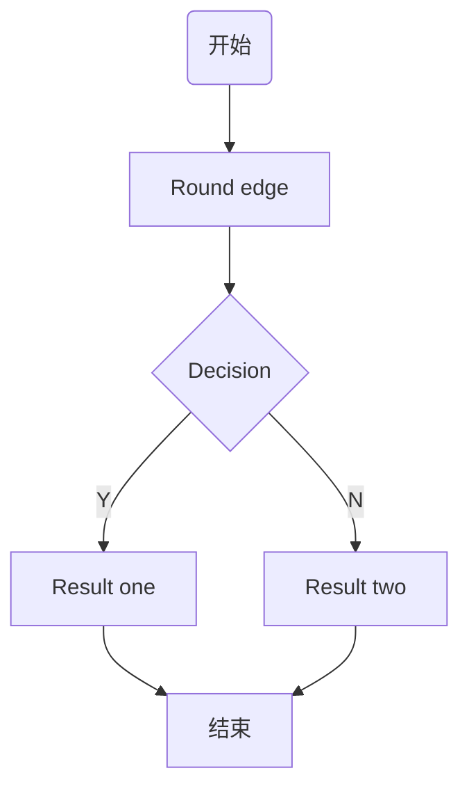
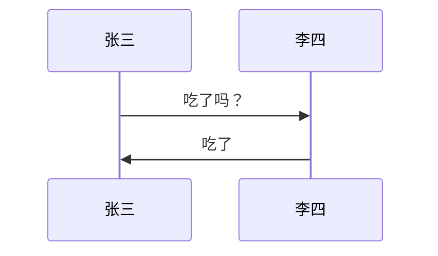

## 标题
> \# 一级标题 
> \## 二级标题
> \### 三级标题 

## 列表
1. 有序列表 
2. 有序列表 
3. 无序列表
## 引用
> 有的人活着，他已经死了；有的人死了，他还活着

## 图片

## 链接
[Google](https://www.google.com/)
## 分割线
***
## 粗体/斜体
**作者**
*张三*
## 代码
```sh
#/bin/sh
echo "hello world"
```
## 区块标识
~~~
这是一个区块
……
~~~
## 表格
|姓名|性别|毕业学校|工资|
|:---|:---:|:---:|---:|
|张三|男|重庆交通大学|3200|
|李四|男|贵州大学|5000|
|王五|女|北京大学|2000|
> :--- 左对齐
> ---: 右对齐
> --- 居中

## 时序图/流程图/甘特图
### sequence
```sequence
title: 时序图例子
A->B: 实线实箭头 
B-->C: 虚线实箭头 
C->>C: 实线虚箭头 
note right of C: 自通知 
note over B,C:横跨通知 
C->A:长通知 
note left of A:左通知
```
### flow
> start,开始
> end,结束
> condition,条件判断
> inputoutput,输入输出
> operation,操作/执行
> subroutine,子任务
> isLogin(yes)->main,isLogin(no)->login,判断流程控制
> login(right),位置指定
> ->,流程控制操作符
> =>,赋值操作符
```flow
start=>start: 开始
isLogin=>condition: 是否登录
login=>operation: 登录
view=>operation: 浏览
end=>end: 结束
start->isLogin
isLogin(no)->login->view
isLogin(yes)->view
view->end
```

### mermaid
1. 简介
> Mermaid 是一个用于画流程图、状态图、时序图、甘特图的库，使用 JS 进行本地渲染，广泛集成于许多 Markdown 编辑器中。
> Mermaid 作为一个使用 JS 渲染的库，生成的不是一个“图片”，而是一段 HTML 代码
2. 图表方向
|用词|含义|
|:---|:---|
|TB	|从上到下|
|BT	|从下到上|
|RL	|从右到左|
|LR	|从左到右|
3. 节点定义
|表述|说明|
|:---|:---|
|id[文字]	|矩形节点|
|id(文字)	|圆角矩形节点|
|id((文字))|	圆形节点|
|id>文字]	|右向旗帜状节点|
|id{文字}	|菱形节点|
4. 节点之间的连接线
|表述	|说明|
|:---|:---|
|>	|添加尾部箭头|
|-	|不添加尾部箭头|
|–	|单线|
|–text–	|单线上加文字|
|==	|粗线|
|==text==	|粗线加文字|
|-.-	|虚线|
|-.text.-	|虚线加文字|
5. 子图表
~~~
subgraph 子图表名称
    子图表中的描述语句...
end
~~~
6. mermaid: 流程图

7. mermaid: 序列图
~~~
sequenceDiagram
    [参与者1][消息线][参与者2]:消息体
    ...
~~~


+ 消息线
|类型	|描述|
|:---|:---|
|->	|无箭头的实线|
|–>	|无箭头的虚线|
|->>	|有箭头的实线|
|–>>|	有箭头的虚线|
|-x	|末端为叉的实线（表示异步）|
|–x|	末端为叉的虚线（表示异步）|